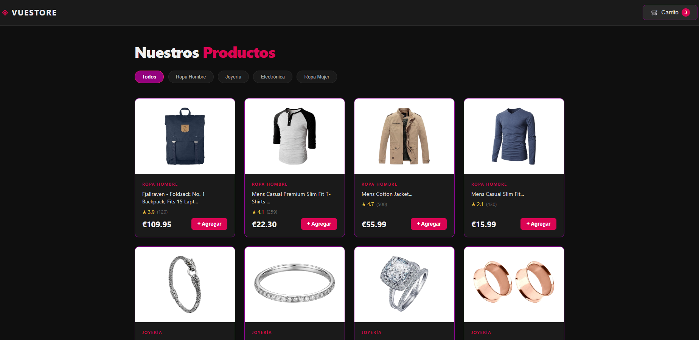
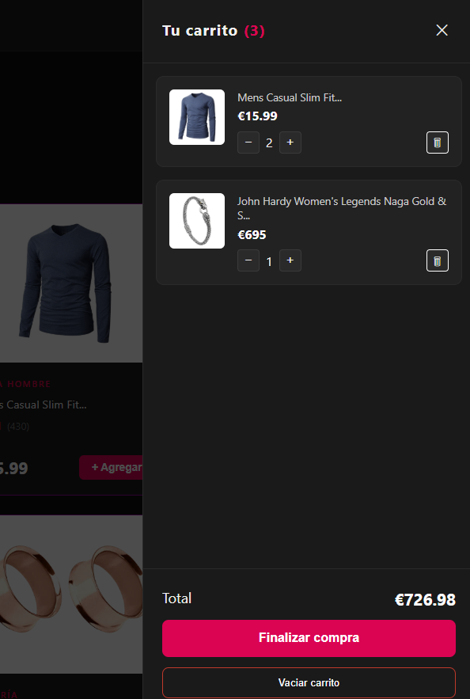
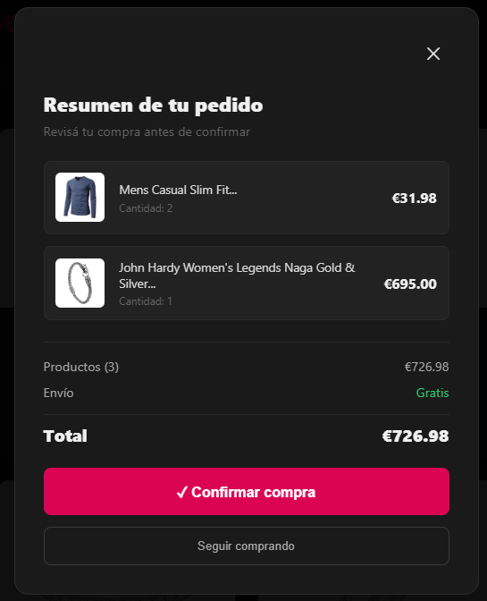

# 🛍️ VueStore

Tienda online desarrollada con Vue 3 como proyecto de aprendizaje y práctica frontend.

## 🔗 Demo

> Próximamente en GitHub Pages

## 📸 Preview






## ✨ Features

- 🛒 Carrito de compras con persistencia en **localStorage**
- 📦 Productos obtenidos desde una **API REST** (FakeStoreAPI)
- 🔍 Filtrado de productos por categoría
- 📄 Panel de detalle por producto con variantes de color y stock simulado
- ⭐ Sistema de reseñas por producto
- 💳 Modal de resumen de compra
- 📱 Diseño responsive

## 🧠 Conceptos de Vue 3 aplicados

- **Composition API** con `<script setup>`
- **`ref` y `computed`** para reactividad
- **`watch`** para sincronizar con localStorage
- **Composables** (`useCart.js`) para lógica reutilizable
- **Props y Emits** para comunicación entre componentes
- **`v-if`, `v-for`, `v-bind`, `v-on`** (directivas)
- **`onMounted`** para llamadas a la API
- **`async/await`** con manejo de errores (`try/catch/finally`)

## 🛠️ Tecnologías

- [Vue 3](https://vuejs.org/) — framework frontend
- [Vite](https://vitejs.dev/) — bundler y servidor de desarrollo
- [FakeStoreAPI](https://fakestoreapi.com/) — API de productos de prueba

## 📁 Estructura del proyecto
```
src/
├── composables/
│   └── useCart.js          # Lógica del carrito + localStorage
├── components/
│   ├── NavBar.vue           # Barra de navegación
│   ├── CartSidebar.vue      # Carrito lateral deslizable
│   ├── ProductList.vue      # Grilla de productos + filtros
│   ├── ProductCard.vue      # Tarjeta individual de producto
│   ├── ProductDetail.vue    # Panel de detalle del producto
│   ├── CheckoutModal.vue    # Modal de resumen de compra
│   ├── ReviewForm.vue       # Formulario de reseñas
│   └── ReviewList.vue       # Lista de reseñas
└── App.vue                  # Componente raíz
```

## ⚠️ Limitaciones conocidas

- Las variantes de color son simuladas por categoría. La API utilizada
  no provee datos de variantes por producto. En una implementación real
  se conectaría con una API que incluya estos datos.
- Las reseñas se guardan en memoria (se pierden al recargar).
  Una mejora futura sería persistirlas en localStorage o en un backend.
- El stock es simulado. No refleja datos reales.

## 🚀 Instalación y uso
```bash
# Clonar el repositorio
git clone https://github.com/SMCominotti/tiendaVue.git

# Entrar al proyecto
cd tiendaVue/mi-tienda-vue

# Instalar dependencias
npm install

# Iniciar servidor de desarrollo
npm run dev
```


## 👩‍💻 Autora

**Stella Maris Cominotti**  
[GitHub](https://github.com/SMCominotti) · [LinkedIn](https://www.linkedin.com/in/stella-maris-cominotti/)